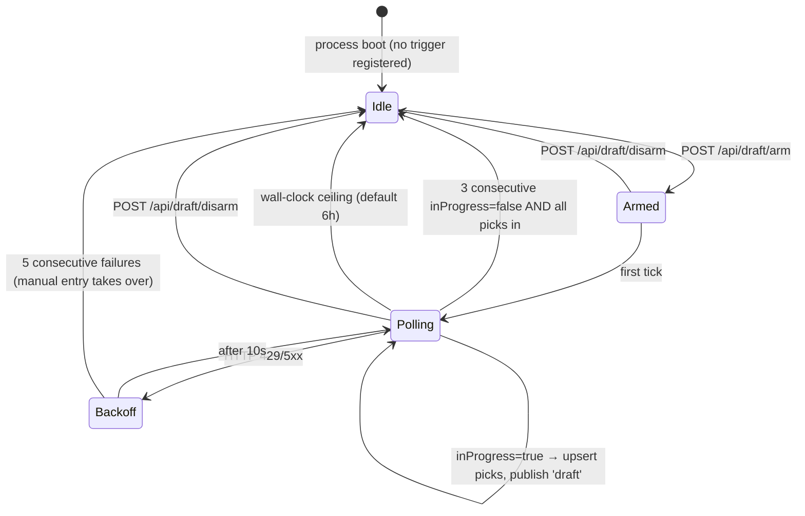

## Context

GridIron today is a read-only aggregator: an in-process APScheduler refreshes a SQLite cache on an adaptive cadence, a differ publishes `data.changed` scope names over SSE, and a TanStack Query frontend invalidates the matching keys ("SSE is the signal, REST is the data"). Every existing surface answers *what already happened*. The Draft Assistant is the first surface that has to answer *what should I do in the next ninety seconds*, and it is the first one where being wrong or slow has a cost.

Three constraints shape everything below.

**The draft is days away.** Phase ordering is not a nicety here. The board plus manual mark-drafted plus the tier alarm must be a shippable, standalone-usable screen before any live-polling code exists, because that combination alone beats the spreadsheet and it depends on nothing that can break on draft night.

**The board is name-keyed.** `backend/gridiron/draft_board/players.json` uses `name` as its primary key — 149 players, no platform IDs — plus 12 defenses that live only in the `.xlsx` DST tab. ESPN keys everything by integer `playerId`. Bridging those two is the highest-risk work in the change, and it is the kind of failure that is invisible until it matters: a silently unmatched Jahmyr Gibbs is a player who never appears as drafted.

**The existing cache is actively hostile to draft polling.** `EspnClient._cached_league_fetch` is the obvious pattern to copy for a new `get_draft()`, and copying it would serve six-hour-stale draft state through a two-second poll loop. This is the most likely silent bug in the entire feature and D5 exists to prevent it.

### Data flow

```mermaid
flowchart TB
    subgraph static["One-time / re-runnable import"]
        JSON["draft_board/*.json<br/>149 players + heuristics"]
        XLSX["2026_Draft_Board.xlsx<br/>DST tab (12 defenses)"]
        WL["ESPN players_wl<br/>full player universe, no auth"]
        JSON --> IMP["draft_board.import_board()"]
        XLSX --> IMP
        WL --> MATCH["name+pos+team matcher<br/>confidence 0.0–1.0"]
        IMP --> MATCH
        MATCH --> BP[("board_players<br/>+ espn_player_id")]
        OVR[("board_id_overrides<br/>manual fixes, survive re-import")] --> MATCH
    end

    subgraph live["Draft night"]
        UI["/draft screen"]
        UI -->|"POST /api/draft/picks<br/>source=manual"| DS["draft_state service"]
        POLL["poll_draft job<br/>armed only, 2–5s"] -->|"mDraftDetail<br/>CACHE BYPASSED"| ESPN["ESPN API"]
        POLL -->|"source=espn"| DS
        DS --> PICKS[("draft_picks<br/>source, overall_pick")]
        PICKS --> POOL["undrafted pool<br/>= board − picks"]
        BP --> POOL
        POOL --> REC["draft_recommender<br/>PURE FUNCTIONS"]
        HEUR[("board_heuristics")] --> REC
        CFG["league config<br/>ESPN mSettings > static"] --> REC
        REC -->|"ranked shortlist<br/>+ fired rule ids"| UI
        DS -->|"fingerprint changed"| DIFF["differ → 'draft' scope"]
        DIFF -->|SSE data.changed| UI
    end

    style POLL fill:#4a2020
    style REC fill:#204a20
```



### Poller lifecycle



## Goals / Non-Goals

**Goals:**

- A Draft screen that is fully usable on draft night with **zero** working ESPN integration — manual mark-drafted, board, tiers, roster panel, recommendations.
- Live ESPN pick ingestion as a strict accelerator on top of that, never a dependency of it.
- Every recommendation cites the `strategy_rules.json` heuristic `id` that produced it. Opaque rankings are useless when you have 90 seconds and need to trust the answer.
- Zero added background cost when no draft is running: the poller holds no trigger until explicitly armed.
- The recommendation engine is pure, synchronous, and unit-testable with no database, no HTTP, and no clock.
- Snake pick math correct for arbitrary `(teams, slot, rounds)` — not hardcoded to the 12-team/1.01 assumption the static config makes.
- Board import is idempotent and re-runnable, and manual ID corrections survive re-import.

**Non-Goals:**

- Yahoo live draft polling. Scoped to manual entry (see D11).
- A projections engine. Every ranking input is a pre-computed static snapshot; we never compute fantasy points.
- Auto-drafting or submitting picks to ESPN. The system advises; the user clicks in ESPN. Writing to a live draft is a different risk class entirely and is not in scope.
- Multi-league drafting. One draft session at a time.
- Live ADP refresh from Fantasy Football Calculator. Noted as a follow-up; the snapshot is one day old at time of writing.
- Keeper/auction/dynasty formats. Snake only.

## Decisions

### D1. Draft state is a pick log with source provenance, not an ESPN mirror

`draft_picks` rows carry `overall_pick` (unique), `board_player_id` or `espn_player_id`, `drafted_by_team`, `is_my_pick`, `source` (`manual` | `espn`), and `created_at`. Manual taps and polled ESPN picks flow through the same `draft_state.record_pick()`.

This inverts the obvious design, in which ESPN is truth and manual entry is an escape hatch. Three reasons:

1. It makes the manual path the *primary* path, which is what lets Phase 2 ship standalone before Phase 4 exists.
2. Undo — which the board's own spec calls essential, because mis-taps happen constantly during a live draft — becomes one operation (`DELETE` the row at `overall_pick = max`) regardless of provenance.
3. If ESPN stalls mid-draft, the user keeps going manually with no mode switch and no data migration.

**Reconciliation.** When a poll returns a pick at an `overall_pick` that already has a manual row, ESPN wins on player identity (it is authoritative about what actually happened) and the row's `source` is upgraded to `espn`, but the event is counted and surfaced in the UI as a corrected pick. Silent overwrites during a draft would destroy the user's trust in the board at exactly the wrong moment. Manual rows at pick numbers ESPN has not yet reached are left alone — they are the user running ahead of the poll.

*Alternative considered:* two tables (`espn_picks` + `manual_picks`) unioned at read time. Rejected — every consumer (pool, roster, recommender, differ) would have to know about the union, and undo across two tables with different ordering semantics is a bug farm.

### D2. Board schema mirrors what is actually in the file, with tier labels normalized out

Reverse-engineered from all 149 records (union of keys verified, not assumed):

```
board_players
  id                 INTEGER PK
  name               TEXT NOT NULL          -- the board's own primary key
  normalized_name    TEXT NOT NULL INDEXED  -- matcher input (D3)
  position           TEXT NOT NULL          -- QB|RB|WR|TE|DST
  nfl_team           TEXT NOT NULL
  bye                INTEGER
  adp                REAL                   -- 145 of 149 have one; 4 are NULL
  adp_rank           INTEGER
  adp_round          INTEGER
  adp_pick           INTEGER
  overall_tier       INTEGER                -- 1–8; NULL for DSTs
  positional_tier    INTEGER                -- 1–7; NULL for DSTs
  risk               TEXT                   -- Low|Low-Med|Med|Med-High|High
  risk_score         INTEGER                -- 1–5
  rookie             BOOLEAN NOT NULL
  out_for_season     BOOLEAN NOT NULL
  unpriced_risk      BOOLEAN NOT NULL  -- CURATED, not derived. See D6.
  note               TEXT
  thesis             TEXT                   -- present when TARGET/FADE
  take_in_round      TEXT                   -- e.g. "Rd 4"; also ranges ("Rd 2-3", "Rd 9-10")
  sleeper_category   TEXT
  catalyst           TEXT
  format_fit         TEXT                   -- Redraft|Best-ball|Deep
  flags              TEXT                   -- JSON array: TARGET|FADE|NEUTRAL|SLEEPER
  injury_tags        TEXT                   -- JSON array (UNRELIABLE — see D9)
  analyst_takes      TEXT                   -- JSON array of {source, verified_accuracy, take, detail}
  espn_player_id     INTEGER INDEXED        -- NULL until matched
  match_confidence   REAL                   -- 0.0–1.0
  match_method       TEXT                   -- exact|team_changed|name_only|fuzzy|override|unmatched

board_tiers        (scope, position, tier) → label     -- 'overall'|'positional'; labels are
                                                        -- repeated verbatim on every player in
                                                        -- the file, so they normalize out
board_heuristics   (id, rule, category)                -- from strategy_rules.json, id is the
                                                        -- citation key recommendations must carry
board_id_overrides (board_name, espn_player_id, set_at)-- manual fixes; applied last, always win
```

JSON-typed columns are stored as `TEXT`, matching design.md D6's dialect-neutrality rule from the scaffold ("no SQLite-only JSON operators in queries").

**DSTs.** The 12 defenses exist only in the workbook's `DST` tab, which uses `t="inlineStr"` cells (verified) across `Defense | Bye | ADP | Rd.Pk | Risk | Note`. They are parsed with stdlib `zipfile` + `xml.etree` — no `openpyxl` dependency for one 16-row sheet — and inserted with `position='DST'` and NULL tiers. Note the workbook and the board README disagree on Seattle's ADP (82.9 vs 81.3); the workbook is authoritative for the tab it owns.

### D3. ESPN ID matching: layered exact-to-fuzzy with confidence, and a mandatory human QA gate

The ID map source is ESPN's **`players_wl`** endpoint (`/seasons/{year}/players?view=players_wl`), not `kona_player_info`: it returns the full player universe, requires no cookies and no league ID, and therefore can be refreshed without a live connection. `kona_player_info` is fetched separately, and only for its ADP/ownership data, which feeds the off-board tail (D10).

Matching runs in strict precedence order, first hit wins:

| Method | Key | Confidence |
| --- | --- | --- |
| `override` | `board_id_overrides.board_name` | 1.0 |
| `exact` | normalized name + position + NFL team | 1.0 |
| `team_changed` | normalized name + position | 0.9 |
| `name_only` | normalized name | 0.8 |
| `fuzzy` | `difflib.SequenceMatcher` ≥ 0.88 within position | 0.6 |
| `unmatched` | — | 0.0 |

Normalization: NFKD unicode fold, lowercase, strip punctuation, strip generational suffixes (`Jr`, `Sr`, `II`, `III`, `IV`), collapse whitespace.

**The QA gate is not optional.** Import writes a report and the `/draft` screen refuses to enter live mode while any player at confidence < 0.9 is unresolved, offering a resolution list instead. The failure mode this prevents — a top-30 player silently never matching, so he never greys out when drafted and keeps getting recommended — is worse than any amount of import friction, and it is undetectable from the UI without this gate.

Anything at `fuzzy` or below is presented for confirmation; confirming writes a `board_id_overrides` row so the decision is permanent.

*Alternative considered:* fuzzy-matching everything with a single threshold and no review. Rejected — 161 entries is small enough that a human can clear the exception list in two minutes, and the cost of a wrong silent match is a corrupted draft.

**DST matching is deliberately separate.** Defenses are matched by NFL team abbreviation against ESPN entries with `defaultPositionId == 16`, never by name — "Seattle Seahawks" vs "Seahawks D/ST" vs "SEA" defeats name matching. The exact ESPN encoding of defense IDs is confirmed against the captured fixture in task 4.1 before this path is written.

### D4. The poller is registered without a trigger and armed by an explicit request

`poll_draft` joins `scheduler.JOBS` like every other job, so it stays invokable via `run_job` and `POST /api/admin/refresh`, but `start_scheduler()` adds **no** trigger for it. `POST /api/draft/arm` adds an `IntervalTrigger`; disarm removes the job. When disarmed the feature costs exactly zero background work, and the existing adaptive cadence for `refresh_fantasy` / `refresh_nfl_state` is untouched.

A `draft_sessions` row (`league_id`, `armed_at`, `disarmed_at`, `status`, `last_poll_at`, `last_error`, `consecutive_not_in_progress`, `poll_interval_seconds`, `ceiling_at`) is the single mutable record of the session.

Auto-disarm fires on **three consecutive `inProgress: false` ticks with a complete pick set**, on a **wall-clock ceiling** (`armed_at + 6h`, configurable), or on explicit disarm. The ceiling exists because a draft that stalls — or an `inProgress` flag that never flips because ESPN's shape differs from what we expect — would otherwise poll every 2 seconds until the process restarts. Requiring a *complete pick set* alongside the false flag prevents disarming during a pre-draft pause where `inProgress` is briefly false.

Poll interval defaults to 3 s (within the user's 2–5 s range), configurable per session. On 429/5xx the session backs off to 10 s; after five consecutive failures it disarms and the UI states plainly that live tracking stopped and manual entry is now the path — a silent stall during a draft is worse than a loud stop.

*Alternative considered:* a low-frequency sentinel poll that detects a draft starting on its own. Rejected — it reintroduces exactly the always-on overhead the user ruled out, to save one button press at a moment when the user is already sitting at the computer.

### D5. The draft poll bypasses `http_cache` and does not write per-tick audit rows

Two explicit carve-outs from existing infrastructure, both load-bearing:

**Cache bypass.** `platforms/espn/draft.py` calls `EspnClient.get()` directly and never touches `_cached_league_fetch`. The existing TTLs (`ROSTER_TTL` 1 h, `TEAM_METADATA_TTL` 6 h) are correct for their endpoints and catastrophic here: a 3-second poll served from a 6-hour cache would show a frozen board with no error anywhere, and the user would find out by drafting a player who was taken two hours ago. The bypass is enforced by a unit test asserting no `http_cache` row is written by a draft fetch, because a future refactor "unifying" the ESPN fetch paths would otherwise silently reintroduce it.

**Audit suppression.** `run_job` writes one `refresh_runs` row per run. At 3 s across a 3-hour draft that is ~3,600 rows of noise in a table the Settings screen reads for "last refresh". `run_job` gains an `audit: bool = True` parameter; `poll_draft` passes `False` and instead updates `last_poll_at` / `last_error` on its single `draft_sessions` row. Failures still log at WARN, so nothing becomes invisible.

### D6. The recommender is a pure function with a documented, tunable scoring model

`services/draft_recommender.py` exposes:

```python
def recommend(
    pool: list[BoardPlayer],       # undrafted, out_for_season excluded
    my_roster: list[BoardPlayer],
    league: LeagueConfig,          # teams, slot, starters, flex_eligible
    current_pick: int,
    picks_until_next: int,
    recent_picks: list[BoardPlayer],  # last 8, for run detection
    weights: Weights = DEFAULT_WEIGHTS,
) -> list[Recommendation]          # each carries score, components, fired_rule_ids
```

No session, no HTTP, no `datetime.now()`. Everything time-varying is an argument, which is what makes the scenarios in the spec testable as table-driven cases.

The composite score, with every term normalized to roughly [-1, 1] before weighting:

| Term | Definition | Default weight |
| --- | --- | --- |
| `value` | `clamp((adp_rank − current_pick) / teams, −2, 3)` — rounds he is falling past his price | 1.0 |
| `tier_urgency` | `clamp((picks_until_next − remaining_in_tier + 1) / picks_until_next, 0, 1)` — roughly, the fraction of his tier that will be gone before the next turn. **Defined as 1.0 when `picks_until_next == 0`** (on the clock: the tier's survival is no longer at issue, take the best of it) — the formula divides by zero otherwise, and on-the-clock is exactly when recommendations are requested. | **1.6** |
| `need` | Unfilled starter demand at his position ÷ total unfilled, with FLEX distributed across `flex_eligible` | 1.0 |
| `risk` | `−(risk_score − 3) / 2` **only when `unpriced_risk` is true**; otherwise 0 | 0.8 |
| `flags` | `+1` TARGET, `−1` FADE, `0` otherwise | 0.5 |

`tier_urgency` carries the heaviest weight deliberately: the board's own spec identifies tier structure as the primary edge in a snake draft, and "recommend the highest-ranked player available" is explicitly called out there as the naive-and-wrong approach. This is what implements the `draft_the_tier` heuristic.

The `risk` term implements `injury_discount`, which is subtler than it looks: a player is only a value if ADP *fell* to compensate for the injury. Penalizing raw `risk_score` would wrongly discount players the market has already discounted.

**`adp_delta` is not computable from the shipped board, and the gate is a curated column instead.** `strategy_rules.json` defines `adp_delta = expert_rank − adp_rank`, but `expert_rank` was never exported — verified against the key union of all 149 records. Two candidate substitutes were tested and both fail on the exact cases the board's own spec names:

- `take_in_round − adp_round` is zero for nearly every one of the 31 annotated players, and is absent entirely for both Jeremiyah Love and Alec Pierce.
- The `FADE` flag is empty on both of them, even though Pierce's own note reads "Hard fade." (See D9 — this is a source-data defect.)

`overall_tier` was also tested and carries no independent signal: the tiers are ADP bands, and the only order inversions against `adp_rank` are running-max artifacts at tier boundaries.

So `unpriced_risk` is a **curated boolean**, seeded by a one-time human pass over the ~40 players at `risk_score >= 4`. The judgment genuinely exists only in the note prose — Love's note reads "ADP has actually RISEN to 30.0. Let someone else pay," Pierce's "ADP still 56.4, which is far too high" — and a keyword parser over prose is precisely the mistake that produced the broken `injury_tags` (D9). Forty rows read once by the person who wrote the board beats a parser, and it is the same argument that justifies the 161-entry match QA gate in D3.

*Rejected:* deriving the gate later from ADP drift (`board.adp − espn_current_adp`). That measures something different — movement *since the snapshot* — and against a one-day-old snapshot it is ≈0 for nearly everyone, including players whose risk was correctly priced before the snapshot. It would flag Christian McCaffrey as unpriced. If live ADP drift is wanted later it should be named as such and scoped to post-snapshot injury news; it is not `injury_discount`.

Weights live in one `DEFAULT_WEIGHTS` dataclass so tuning is a single-file change, and the returned `Recommendation.components` breaks the score into its terms so the UI can show *why* rather than a bare number.

**Categorical rules run separately from the score.** `qb_wait`, `no_kicker`, `dst_last`, `elite_te_window`, `handcuff_own_studs`, and `bye_stacking` are filters and alerts, not score terms — they either suppress a candidate, force one in, or raise a warning. Mixing them into a weighted sum would make "never recommend a QB before pick 50" merely a strong preference, which is not what the rule says.

`elite_te_window` is implemented from the rule text verbatim — it names McBride and Bowers and the pick-30 threshold explicitly, so the expert-rank comparison is already baked into the rule and no derived field is needed.

### D7. Replacement level is computed from league settings, with FLEX counted as real demand

The single most consequential league fact is that 2 FLEX slots on top of 2 RB / 2 WR / 1 TE means up to 54 RB/WR/TE start weekly across 12 teams. Replacement level is therefore ~RB30/WR30, not RB24/WR24, and a naive standard-league model would systematically undervalue RB/WR depth.

```
replacement_rank(pos) = teams × (starters[pos] + flex_share[pos])
flex_share[pos]       = starters["FLEX"] × historical_flex_usage[pos]
```

with `historical_flex_usage` defaulting to `{RB: 0.45, WR: 0.45, TE: 0.10}` — a stated assumption, not a measurement, and flagged as such in the spec. This is what implements `flex_pressure`.

Starter slots come from ESPN `mSettings`' `lineupSlotCounts`, which is keyed by `lineupSlotId`. **`platforms/espn/slot_table.py` already translates those IDs** and is reused rather than reimplemented.

### D8. SSE gets a new `draft` scope — and `queryKeyForScope` must be updated with it

`services/differ.py` gains `draft_fingerprints()`, hashing `(max(overall_pick), count(picks), session.status)`. When it changes, `data.changed` publishes scope `"draft"`.

`frontend/src/api/events.ts`'s `queryKeyForScope` is a **hardcoded whitelist that returns `null` for unrecognized scopes**, and `invalidateScopes` skips nulls without logging. A `draft` scope not added there yields an SSE event that fires, parses, matches nothing, and does nothing — no error, no warning, no live updates, and a debugging session on draft night. This gets its own task and its own test asserting `queryKeyForScope("draft") !== null`.

### D9. Data-quality carve-outs the board's own spec demands

- **`injury_tags` are keyword-derived from note prose and are known-wrong.** Jahmyr Gibbs carries an `mcl` tag because his note mentions *Pacheco's* MCL sprain. They are indexed for search and displayed as a search aid, and the `handcuff_own_studs` heuristic keys off `risk_score >= 4` **only** — never off an injury tag.
- **Bye weeks come from `Player.bye_week` (ESPN), not `schedule.json`.** A prior revision of that file had five teams wrong (ARI, CAR, PHI, DEN, LV), and bye-collision warnings are precisely where a wrong bye does damage. `schedule.json` is used only for what ESPN does not provide: playoff-schedule strength and the DST early-schedule streams. When a board bye and an ESPN bye disagree, ESPN wins and the discrepancy is logged at import.
- **The `flags` array is incomplete and disagrees with the notes.** Jeremiyah Love and Alec Pierce both carry empty `flags` despite Pierce's note reading "Hard fade" and Love's reading "Let someone else pay" — and these are the two players the board's own spec names as the canonical unpriced-risk cases. The FADE score term therefore silently misses cases. This is a **source-data defect only the user can fix** by re-exporting the board; the curated `unpriced_risk` column (D6) covers the recommendation path in the meantime, and the import reports every `risk_score >= 4` player whose flags are empty so the gap is visible rather than assumed away.
- **`take_in_round` is not always a single round.** Values include ranges (`"Rd 2-3"`, `"Rd 9-10"`) alongside the simple form, so any parser must be range-tolerant. It is display-only; nothing scores off it.
- **`out_for_season` players are excluded from the draftable pool but remain searchable**, so the user does not wonder where someone went.

### D10. The board runs out before the draft does

161 board entries (149 + 12 DST) against ~180 picks in a 12-team, 15-round draft. Past the board, the pool falls back to ESPN `kona_player_info` ADP ordering, rendered in a visually distinct "off board" section. Off-board players are never ranked above a board player in the recommendation shortlist and always carry an explicit "not on your board" note — the board's absence of a player is itself information, and quietly interleaving ESPN's opinion with the user's own rankings would destroy that signal.

### D13. The current pick number is tracked explicitly, not inferred from pick count

`picks_until_next` is the sole input to tier urgency and the tier-break alarm, and it derives from the current overall pick. Inferring that as `count(picks) + 1` is wrong in the realistic manual case: on draft night the user marks *some* picks — their own, plus the ones that matter to them — not all 180. The count then drifts below the true pick number and every urgency calculation and alarm fires against a wrong `n`, silently.

The active `draft_sessions` row therefore carries `current_overall_pick` as an explicit, user-correctable value. Manual marking advances it by one; a control on the Draft screen sets it directly when the user has skipped picks; the ESPN poll overwrites it with the authoritative value when armed. This is in phase 3, on the must-ship path, because the tier alarm is worthless without it.

*Alternative considered:* requiring the user to mark every pick. Rejected — it does not survive contact with a live draft, and a tool that degrades silently when used the way it will actually be used is worse than one that asks for a number.

### D11. Yahoo is manual entry only

Yahoo's `draftresults` resource is not known to populate before a draft completes, and confirming that costs time this change does not have. The `draft_picks` table has no ESPN-specific columns, so a Yahoo poller is an additive follow-up, not a rewrite. Yahoo drafts are fully supported through manual entry today.

### D12. Draft-night degraded modes are designed, not discovered

| Failure | Behavior |
| --- | --- |
| SSE disconnected | The existing 5-minute fallback poll is far too slow for a draft. While `/draft` is mounted **and** SSE is disconnected, the draft queries poll at 5 s. Scoped to this screen only. |
| ESPN poll failing | Session disarms after 5 consecutive failures with a visible banner; manual entry continues uninterrupted. |
| Board partly unmatched | Live mode is gated behind the D3 QA resolution list. |
| ESPN settings unreadable | Fall back to static `league_config.json` with a persistent warning banner naming every field that could not be confirmed. |
| Backend unreachable | Out of scope — the app is the backend. Noted in the README as the reason to keep the printed board as a backup. |

## Risks / Trade-offs

**ESPN `mDraftDetail` may not expose live in-progress state at all** → This is the one assumption the whole polling phase rests on and it is currently unverified. Mitigated structurally: manual entry is the primary path (D1) and ships two phases earlier, so a negative finding costs the polling phase and nothing else. Task 4.1 captures a real mid-draft payload and confirms `inProgress` plus a populated `picks` array *before* any parser is written.

**Name→ID matching silently drops a top player** → The QA gate (D3) blocks live mode while anything is unresolved, and `board_id_overrides` makes each correction permanent.

**A future refactor re-introduces caching on the draft path** → Guarded by an explicit unit test asserting no `http_cache` write, plus a comment at the call site naming the failure.

**The scoring weights are asserted, not fitted** → There is no training data and no time to build any; the model is transparent, every term is exposed in `components`, and weights are a one-line change. Documented as tuned-by-judgment rather than measured.

**`tier_urgency` assumes tier members are all within reach of the next `n` picks** → Overstates urgency for a tier whose remaining members have ADPs far below the current pick. Accepted for v1: it biases toward taking the last player in a breaking tier, which is the board's stated strategic preference anyway. Refinement noted as follow-up.

**ADP is a snapshot that ages daily during draft season** → It is one day old at time of writing and the draft is days away, so drift is small. The refresh path (Fantasy Football Calculator publishes CSV/JSON for 12-team half-PPR) is documented but not built.

**A 2-second poll against an unofficial ESPN API for three hours may draw rate limiting** → Default is 3 s, backoff on 429 is 10 s, and five consecutive failures disarm cleanly rather than hammering.

**Scope risk: the draft is days away and this is a four-capability change** → Phases 1–3 are the shippable core and depend on nothing external. Phases 4–6 are strictly additive. If time runs out mid-change the user still has a working draft app.

## Migration Plan

Purely additive — new tables, new routes, one new job registry entry. No existing table, endpoint, or job changes shape.

1. `alembic upgrade head` creates the six new tables.
2. `python -m gridiron.draft_board import` loads the JSON board and the DST tab, fetches `players_wl`, matches, and writes the QA report.
3. Resolve any confidence < 0.9 entries in the UI (writes `board_id_overrides`).
4. `make deploy` ships the frontend with the `/draft` route.
5. Arm the session at draft time; disarm afterwards.

**Rollback:** disarm the session and stop using the screen — nothing else in GridIron reads any of the new tables. A full revert is `alembic downgrade` plus dropping the route; no data owned by other features is touched.

## Open Questions

1. **Does `mDraftDetail` populate `inProgress` and `picks` mid-draft?** Blocks the polling phase only. Resolution: capture a mock-draft payload (task 4.1) — the user is running this capture.
2. ~~**How does ESPN encode D/ST entries** in `players_wl` / `kona_player_info`?~~ **RESOLVED** (task 0.3, 2026-08-23) by fetching `players_wl` directly — it needs **no cookies and no league id**, so it did not require the user's capture. Findings, fixture committed at `tests/fixtures/espn/draft/players_wl.json`:
   - The endpoint returns a **flat JSON array** (2,616 entries for 2026), not an object with a `players` key. Fields: `id`, `fullName`, `firstName`, `lastName`, `defaultPositionId`, `proTeamId`, `eligibleSlots`, `ownership.percentOwned`.
   - **There is no NFL team abbreviation in the payload** — only `proTeamId`. Matching on `(name, position, nfl_team)` therefore depends on `platforms/espn/mapper.py`'s `PRO_TEAM_MAP`, which covered only 17 of 32 clubs; every unmapped club fell back to `"FA"`, which would have demoted those players from `exact` to `team_changed` and broken DST matching outright. **Completed to all 32 clubs**, derived from the D/ST entries themselves and using the board's abbreviation convention (JAX, LV, WAS, NE, NO). ESPN leaves ids 31 and 32 unused.
   - **D/ST**: `defaultPositionId == 16`, 32 entries, `eligibleSlots == [16, 20, 21]`. `id` is **negative and deterministic**: `id == -16000 - proTeamId` (Falcons `-16001` … Texans `-16034`). `fullName` is `"{nickname} D/ST"` — the **club nickname, never the city** ("Falcons D/ST", not "Atlanta"). So DST matching keys on `proTeamId → abbreviation` against the board's `team`, exactly as D3 specified, and name-based methods stay off.
   - Position ids confirmed: 1=QB, 2=RB, 3=WR, 4=TE, 5=K, 16=DST; 9–13 are IDP. The committed fixture is trimmed to the draftable set (1,027 of 2,616) — IDP entries dropped, since nothing in this change drafts them.
   - The capture script now lives in the repo at `scripts/capture-espn-draft.sh` rather than a scratch directory.
3. **What is the actual draft slot?** Unknown until the draft order is set. Pick math is slot-generic; the pre-built 1.01 plan renders only at slot 1.
4. **Bench size** is not stated anywhere in the board data. Defaults to 6, configurable, and read from ESPN `mSettings` when available.
5. **Non-reception scoring values** are assumed in `league_config.json`, not confirmed. Low impact — nothing in this change computes fantasy points — but it is why ESPN `mSettings` is the authority (D12).
6. **Should the board be re-exported to fix the missing `FADE` flags?** Love and Pierce read as hard fades in prose but carry empty `flags` (D9). Only the user can regenerate the export. If it is regenerated, the curated `unpriced_risk` seed should be re-checked against it; if not, `unpriced_risk` carries that judgment alone and the FADE term simply under-fires.
