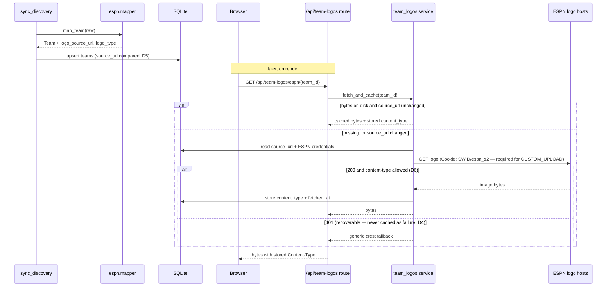

## Context

This app already caches one class of remote image: player headshots. `services/headshots.py` fetches from a deterministic public CDN pattern, writes PNG bytes to disk, and `api/headshots.py` serves them at `/{platform}/{player_id}.png` with a PNG silhouette fallback.

Team logos look like the same problem and are not. Three probe findings break the resemblance, and each one drives a decision below.

## Probe findings (the factual basis)

Run against the five live leagues' cached `mSettings`+`mTeam` payloads and the logo hosts themselves.

| # | Question | Answer |
|---|---|---|
| P1 | Does ESPN carry team logos? | **Yes** — `logo` + `logoType` on every team, 50/50 across 5 leagues |
| P2 | What formats? | Two: `VECTOR` (SVG, ESPN's stock set) and `CUSTOM_UPLOAD` (extensionless URL, served as `image/jpg`) |
| P3 | Are they publicly fetchable? | **Split.** VECTOR yes; CUSTOM_UPLOAD returns **401 without ESPN cookies** |
| P4 | Divisions? | All five leagues are single-division |

```
                            no cookies          with cookies
VECTOR                      200 image/svg+xml   200 image/svg+xml   2,876 B
  g.espncdn.com/lm-static/ffl/images/default_logos/6.svg

CUSTOM_UPLOAD               401 application/json 200 image/jpg      7,870 B
  mystique-api.fantasy.espn.com/apis/v1/domains/lm/images/2ed595e0-…
```

P3 is the load-bearing one: **half of these images cannot be rendered by a browser at all.** `` from the frontend sends no ESPN cookies and gets a 401. Proxying through the backend is not an optimization here, it is the only thing that works.

## Goals / Non-Goals

**Goals**

- Every team renders with its real logo, on all four surfaces, including the ones ESPN will not serve to a browser.
- A league page that answers "who is winning this league and where am I" without opening ESPN.
- Standings order that matches ESPN's, and that is deterministic even when ESPN gives us nothing to sort by.

**Non-Goals**

- Rasterizing SVG, Yahoo logos, logo editing, playoff odds, division grouping (see proposal).

## Flow



## Decisions

### D1. A sibling service, not an extension of headshots

`team_logos.py` mirrors `headshots.py` rather than generalizing it.

The headshot module has PNG baked into its contract in three places: the route's `.png` suffix, `headshot_path`'s filename, and `read_silhouette()`'s PNG fallback bytes. Logos are SVG *and* JPEG, so all three would need to become variable — and the one caller that benefits is this change. Generalizing would put churn into the path that renders every player on every screen, to serve a feature that shares no format, no host, and no auth model with it.

*Alternative rejected:* a shared `remote_images.py`. Worth revisiting only if a third image type appears; two is not a pattern.

### D2. The route is extensionless and the content type is stored

`GET /api/team-logos/{platform}/{team_id}` — no `.png`.

The source URL for a custom upload is a bare UUID path with no extension, and its content type comes back as `image/jpg` (not the standard `image/jpeg`), so the format cannot be inferred from either the URL or a guess. It is read from the response's `Content-Type` at fetch time, stored on the row, and echoed back on serve. The on-disk file is named by team id with no extension; the database is the authority on how to interpret it.

### D3. Fetching requires credentials, so it happens server-side

The service decrypts the stored ESPN cookies for every fetch, which `headshots.py` never has to do (its CDN is public).

This is forced by P3, and it has a knock-on: logo fetches must not run before ESPN is connected. The service returns the fallback rather than raising when no connection row exists, so a fresh install renders crests instead of erroring on every team.

### D4. A 401 is retryable and is never cached as a failure

Expired `espn_s2` cookies are a normal, recoverable state in this app — the whole Settings "ESPN Credentials" flow exists for it. If a 401 wrote a permanent "no logo" marker, every team would silently lose its logo until the cache was manually cleared, and reconnecting would not fix it.

So: a 404 from the source is cacheable (the image really is gone), a 401 is not. The fallback crest is returned for the request without recording a failure.

### D5. The stored `source_url` drives invalidation

A custom upload's URL is a UUID that changes when the leaguemate changes their logo. Keying only on team id would serve stale bytes indefinitely.

`sync_discovery` already refreshes team metadata every 6h and writes `logo_source_url`. The service compares the stored URL against the bytes it holds and refetches on mismatch, which makes invalidation free and correct without a TTL guess. `Headshot` already stores `source_url` for exactly this shape.

### D6. SVG is allowlisted to ESPN's own host; custom uploads must be raster

An SVG served from this app's origin can carry `<script>` with same-origin access to everything the app can reach. VECTOR logos come from ESPN's stock set on `g.espncdn.com` and are safe; `CUSTOM_UPLOAD` bytes are leaguemate-supplied content.

The rule: `image/svg+xml` is accepted **only** when the source URL's host is `g.espncdn.com`. Custom uploads are accepted only as raster types (`image/png`, `image/jpeg`, `image/jpg`, `image/gif`, `image/webp`). Anything else falls back to the crest. Responses also carry `X-Content-Type-Options: nosniff` so a mislabeled raster cannot be re-interpreted as markup.

*Alternative rejected:* rasterizing SVG on ingest. It closes the same hole at the cost of a heavy imaging dependency, and it degrades ESPN's crisp vector logos.

### D7. Standings order: ESPN's seed first, with a deterministic floor

The user asked for ESPN's own ordering, so `playoffSeed` is the primary key.

It cannot be the only key. `playoffSeed` is `0` for **every** team in GAS Lab while THE LEAGUE has 1–10, and in the preseason every team is `0-0-0` with `points_for = 0.0`. Sorting on ESPN's seed alone therefore leaves whole leagues with ten identical keys, and `sorted` being stable means the rendered order is whatever the query happened to return — unstable between runs, and invisible to any test that does not look for it. This codebase already documents that exact failure mode on `SLOT_ORDER`.

The key is `(seed_is_zero, seed, -wins, -points_for, team_id)`:

- teams with a real seed sort first, in ESPN's order;
- teams without one fall back to record, then points, matching the standard tiebreak;
- `team_id` is the floor, so a total tie still renders the same way twice.

This honors "trust ESPN" wherever ESPN actually said something, and is well-defined where it did not.

### D8. One flat table, but ordering is division-aware in shape

P4 found all five leagues single-division (one division, id 0, named "League Standings" or "THE ONLY DIVISION"). The page renders one table.

`divisionId` is still carried through and sorted on ahead of the seed, so a multi-division league groups correctly rather than interleaving two divisions' seeds — which would look like a scrambled table rather than an obvious bug. Rendering the group headers is deferred until a league actually has them.

### D9. The League page is team-scoped

`/team/:teamId/league`, not `/league/:leagueId`.

The user is in five leagues and reaches everything through a selected team; the league is derivable from the team, and the existing `teamRoute` machinery, remembered-team behavior, and context-bar tabs all work unchanged. A separate top-level league route would need its own selector for something the shell already tracks.

## Archive order

`gridiron-ui`'s shell requirement has been renamed by each screen-adding change in turn: Five → Six (`add-game-day-view`) → Seven (`add-player-pool`) → Eight (here). Archiving out of order leaves a rename with no target. Verified on a throwaway copy: the wrong order aborts with *"target spec does not exist"* and changes no files; the chain `scaffold-gridiron` → `add-game-day-view` → `add-player-pool` → `add-league-standings` applies cleanly.

## Risks

- **ESPN moves the logo hosts or the auth model.** Both are undocumented. The failure is visible (crests everywhere), not silent, and `scripts/probe-espn-team-logos.py` reproduces the exact requests.
- **Standings acceptance cannot come from live data yet.** Week 1 has not been played, so every record is `0-0-0`. D7's tiebreak is therefore verified with fabricated records in tests, not by looking at the page — the page cannot show a wrong sort until real records exist.
- **Custom uploads at 20px.** Leaguemate photos may be unreadable in the sidebar. The component renders at the size it is given; if it reads badly, the fix is to fall back to the crest below a size threshold, not to change the pipeline.
