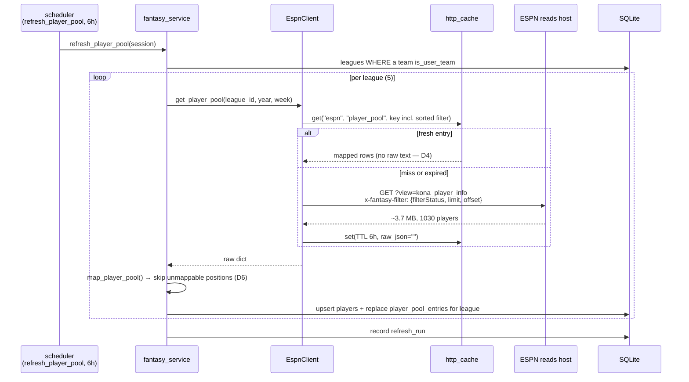

## Context

This app has never fetched a player it doesn't own. Every existing ESPN call is league-scoped and roster-shaped: `get_league` (settings + teams), `get_roster`/`get_matchup` (one shared `mRoster`+`mMatchupScore`+`mBoxscore` response). All three flow through `_cached_league_fetch`, which keys the cache on `http_params` and persists the raw response text per design.md D7.

The player pool breaks three of those assumptions at once — it is selected by a **header**, not params; it is two orders of magnitude larger than anything cached today; and the number it carries is meaningful only *within one league*. Each gets a decision below.

Everything here was verified against the live account with `scripts/probe-espn-player-pool.py` before being designed. The probe is committed alongside this change so the findings can be re-checked when ESPN moves.

## Probe findings (the factual basis)

| # | Question | Answer |
|---|---|---|
| Q1 | Which stat rows come back? | Four per player, disambiguated by `seasonId` — **not** by the `(scoringPeriodId, statSourceId, statSplitTypeId)` tuple alone |
| Q2 | Is `appliedTotal` league-scoped? | **Yes.** Pass-catchers differ across ppr/half_ppr; QBs are identical |
| Q3 | What selects the pool? | The `x-fantasy-filter` header's `filterStatus`; 310 KB for 50 players |
| Q4 | Is availability in the same payload? | **Yes** — `status`, `onTeamId`, `ownership.percentOwned`. One call |
| Q5 | What does a full pull cost? | 3.5–3.7 MB per league; **~18.5 MB across five as an upper bound** |
| Q6 | Is the row count a server-side cap? | **No** — 1030 at both `limit=1500` and `limit=3000`. No pagination needed |
| Q6 | What does including `ONTEAM` cost? | +151 players / +0.93 MB in a drafted league. Required by D7 |

Per-league measurements, because one number would mislead:

```
GAS Lab 2025 (undrafted)  FA+WAIVERS          1030 players    3.70 MB
GAS Lab 2025 (undrafted)  FA+WAIVERS+ONTEAM   1030 players    3.70 MB   (0 rostered — nobody has drafted)
THE LEAGUE   (drafted)    FA+WAIVERS           821 players    2.55 MB
THE LEAGUE   (drafted)    FA+WAIVERS+ONTEAM    972 players    3.48 MB   (151 rostered)
```

An undrafted league's "free agent pool" is the entire player universe, which is why the 1030 figure is a ceiling rather than a typical league. Including `ONTEAM` narrows the spread: drafted leagues converge toward the same size. **~3.7 MB per league is the planning number, ~18.5 MB the five-league upper bound.**

Q1 in full, for Jahmyr Gibbs:

```
{scoringPeriodId: 1, statSourceId: 1, statSplitTypeId: 1, seasonId: 2026}  -> 21.57   week-1 projection
{scoringPeriodId: 0, statSourceId: 0, statSplitTypeId: 0, seasonId: 2025}  -> 366.90  last season, actual
{scoringPeriodId: 0, statSourceId: 0, statSplitTypeId: 0, seasonId: 2026}  ->   0.00  this season, actual (week 1)
{scoringPeriodId: 0, statSourceId: 1, statSplitTypeId: 0, seasonId: 2025}  -> 317.28  last season, projected
{scoringPeriodId: 0, statSourceId: 1, statSplitTypeId: 0, seasonId: 2026}  -> 364.86  THIS SEASON, PROJECTED  <-- the one we want
```

Q2 in full — same `playerId`, two leagues, season projections:

```
Joshua Palmer     ppr 111.20   half_ppr  90.37   DIFFERS
Jauan Jennings    ppr 192.74   half_ppr 157.65   DIFFERS
Malik Washington  ppr  55.99   half_ppr  45.99   DIFFERS
Kyler Murray      ppr 306.94   half_ppr 306.94   SAME
Tommy DeVito      ppr   0.00   half_ppr   0.00   SAME
```

Every player that differs catches passes; every player that matches is a quarterback. That is PPR scoring appearing exactly where it should, which is what makes this a confirmation rather than a coincidence.

## Goals / Non-Goals

**Goals**

- One ingestion path that three future features can consume without re-plumbing.
- A waiver view that answers "is this player better than what I would drop," not "who is projected highest."
- Cost that a 2019 iMac can absorb on a 6h cadence without bloating SQLite.

**Non-Goals**

- Writing claims (read-only; see proposal Non-Goals).
- Modeling true rest-of-season value (D3).
- Any change to how rosters, matchups, or live state are fetched.

## Flow



## Decisions

### D1. Per-league projection rows, not columns on `players`

`player_pool_entries` is keyed `(league_id, player_id)` and holds `season_proj_points` alongside availability.

Q2 forces this for projections. Availability forces it independently: a player free in "THE LEAGUE" may be rostered in "Martini Football League," so `status`/`on_team_id` are league-scoped facts regardless of how scoring resolves. Even if ESPN later made projections scoring-independent, the table shape would not change.

*Alternative rejected:* `players.season_proj_points`. It would silently hold whichever league synced last — wrong in four of five leagues, and wrong in a way no test would catch without a multi-league fixture.

### D2. The season-projection accessor keys on `seasonId`

```python
def _season_projection(player: dict, season: int) -> float | None:
    for stat in player.get("stats", []):
        if (
            stat.get("scoringPeriodId") == 0
            and stat.get("statSourceId") == STAT_SOURCE_PROJECTED
            and stat.get("statSplitTypeId") == STAT_SPLIT_SEASON
            and stat.get("seasonId") == season          # <-- load-bearing
        ):
            return stat.get("appliedTotal")
    return None
```

`mapper._player_points` matches on `scoringPeriodId` + `statSourceId` only. Copying that pattern here would match **two** rows — 2025's projection and 2026's — and return whichever ESPN happened to order first. Gibbs would score 317.28 or 364.86 depending on payload order. `seasonId` is not optional and returns `None` rather than `0.0` on absence, so "no projection" stays distinguishable from "projected to score nothing" (Tommy DeVito genuinely projects 0.0).

### D3. "Rest of season" means season-total minus actuals to date

ESPN does not publish a remaining-season projection. The honest derivation is `season_proj_points - points_scored_to_date`, and this change stores only the raw season projection, deriving the remainder at read time when actuals exist.

Right now it is week 1 with zero actuals league-wide, so the two are identical and nothing is lost. The API field is named `season_proj_points` — not `ros_points` — so the distinction survives into next month when it starts to matter. A modeled ROS number (schedule strength, injury-adjusted games remaining) is out of scope.

### D4. The pool is exempt from D7 raw-response retention

design.md D7 keeps raw response text in `http_cache` to replay platform schema changes. At ~3.7 MB per league × 5 leagues × every 6h refresh, that policy would add up to ~18.5 MB per cycle to SQLite for a payload whose useful content is ~12 columns per player.

`get_player_pool` therefore stores a cache entry with an **empty** `raw_json` and relies on `player_pool_entries` as the durable record. The replay-debugging D7 protects is preserved by `scripts/probe-espn-player-pool.py`, which fetches and dumps the same payload on demand.

*Alternative rejected:* a shorter TTL. It reduces how long the bloat sits, not how much is written, and a pool that changes on waiver-processing timescales does not need a fast cadence anyway.

### D5. The cache key folds in the serialized filter, with sorted keys

`_cached_league_fetch` builds its key from `http_params`. The pool's selectivity lives entirely in a header, so two different filters against the same league would collide on one cache entry.

The filter JSON is serialized with `sort_keys=True` and added to the key params. Sorting is not cosmetic: `json.dumps` preserves insertion order, so an unsorted filter produces a different `params_hash` every time a dict is built in a different order, causing permanent phantom misses and a full refetch on every tick.

### D6. Unmappable positions are skipped, not raised

`_map_player` raises `UnknownSlotError` on an unrecognized `defaultPositionId` — correct for a roster, where silently dropping a player the user owns would corrupt a lineup. The pool is a different contract: it is a league-wide catalog that legitimately contains IDP and other positions this app has no internal vocabulary for, and one unknown id must not abort a 1030-player sync.

`map_player_pool` catches `UnknownSlotError` per entry, counts the skips, and returns them in the job's summary string so a rise in skips is visible in `refresh_runs` rather than silent.

### D7. Waiver rows are ranked by delta against the user's weakest starter — and the filter includes `ONTEAM` to make that possible

Each row carries `delta_vs_worst_starter` = the candidate's season projection minus that of the lowest-projected starter the user currently rosters at an eligible slot. A raw leaderboard is dominated by players who are unrostered for good reason in leagues where the user is already strong at that position.

**Both sides of that subtraction must be season-scoped, and only one of them was.** A `FREEAGENT`/`WAIVERS` filter by construction never returns a rostered player, so nothing in this design would have carried a season projection for a starter. The only projection this app stores for a rostered player is `roster_slots.proj_points`, which is a **weekly** number — `_player_points` matches `scoringPeriodId == week`. For Gibbs that is 21.57 against a season projection of 364.86. Subtracting one from the other is a ~17× unit mismatch that would rank every candidate as an enormous upgrade, and nothing about the resulting number would look obviously wrong.

The filter therefore includes `ONTEAM` alongside `FREEAGENT` and `WAIVERS`, so `player_pool_entries` holds a league-scoped season projection for every player in the league, rostered or not. Q6 priced this: +151 players and +0.93 MB in a drafted league. It also makes the `status` vocabulary (`FREEAGENT | WAIVERS | ONTEAM`) honest — without it, the third value could never occur.

The comparison uses `eligibleSlots` from the pool payload against the user's current `roster_slots`, so a FLEX-eligible RB is compared against the weakest of the RB/FLEX starters rather than against a positional average. The starter's *identity* comes from `roster_slots`; the starter's *projection* comes from `player_pool_entries`, never from `roster_slots.proj_points`.

*Alternative rejected:* scaling the weekly number to a season equivalent (`proj_points × games_remaining`). It manufactures precision the source does not have, and it would break the moment a bye or an injury made "games remaining" wrong for one player and not another.

### D8. `refresh_player_pool` is its own job, not part of `refresh_fantasy`

`refresh_fantasy` reschedules itself from live state down to 30s during games. Attaching an 18.5 MB fan-out to that cadence would issue it up to 120× per hour on a Sunday.

The pool job runs on a fixed 6h interval, independent of live state — waiver availability changes when claims process (nightly), not when a game is in progress.

## Risks

- **ESPN moves the filter or the view.** These are unofficial endpoints; `kona_player_info` and `x-fantasy-filter` are not documented or versioned. Mitigation: the probe script reproduces the exact call, and D6's skip-counting surfaces partial breakage in `refresh_runs` instead of hiding it. A hard break is a visible job failure, not corrupt data.
- **`filterIds` is already known-broken.** The probe got HTTP 400 from it, which is why nothing in this design depends on fetching a single player by id.
- **Pool size grows with league count.** Cost is linear in leagues, and five is the current number. If it grows substantially, the fan-out (not the per-league payload) is where to look first.
