## Context

GridIron is a single-user, self-hosted fantasy football dashboard that aggregates Yahoo and ESPN leagues into one view styled after Apple Health/Fitness on dark mode. The design bundle — `GridIron.html` in the Claude Design project at <https://claude.ai/design/p/1692dcc6-8418-4f8f-9139-5d19358beaca?file=GridIron.html>, imported via the claude_design MCP (`https://api.anthropic.com/v1/design/mcp`, auth via `/design-login`) — ships a complete React prototype with a five-screen surface, design tokens, and SVG chart primitives. Production work is to recreate that visual output against real Yahoo and ESPN data with real-time updates.

The deployment target is **the user's 2019 Intel iMac**: one always-on FastAPI process under launchd serving the API, an SSE event stream, and the built frontend. The user's phone and laptop reach it over **Tailscale**; Tailscale Serve provides a stable HTTPS URL inside the tailnet. There is no serverless platform anywhere: the scheduler is in-process (APScheduler), state is a SQLite file, headshots are a disk folder, and live-feel is **pushed over SSE** the moment the backend refreshes its cache — the original design intent, previously foreclosed by Vercel's function model.

Development happens on the user's Apple Silicon (M4) machine; the iMac is Intel. Environments are kept identical with uv lockfiles rather than Docker (images don't port across those architectures, and Docker Desktop's VM is unwelcome overhead on an always-on 2019 iMac).

### Deployment topology

```mermaid
flowchart LR
    subgraph dev["M4 dev machine"]
        DEV["vite dev + uvicorn --reload"] -->|git push| REPO[(git remote)]
        MAKE["make deploy"] -.->|ssh over tailnet| IMAC
    end

    subgraph IMAC["2019 iMac (always on, launchd)"]
        subgraph PROC["FastAPI process :8000"]
            API["/api/* REST"]
            SSE["/api/events SSE"]
            STATIC["frontend/dist static files"]
            SCHED["APScheduler<br/>adaptive refresh loop"]
            BUS["asyncio pub/sub bus"]
            SCHED -->|cache write + diff| BUS --> SSE
        end
        DB[("SQLite<br/>data/gridiron.db")]
        HS[("data/headshots/")]
        PROC --- DB
        PROC --- HS
        TSS["Tailscale Serve<br/>https://imac.tailnet.ts.net"] --> PROC
    end

    SCHED -->|httpx| YAHOO["Yahoo Fantasy API"]
    SCHED -->|httpx| ESPN["ESPN Fantasy API"]
    SCHED -->|httpx| NFL["ESPN public scoreboard"]

    PHONE["iPhone (Tailscale app)"] --> TSS
    LAPTOP["Laptop (Tailscale app)"] --> TSS
```



## Goals / Non-Goals

**Goals:**

- Pixel-fidelity reproduction of every screen in the design bundle, with the prototype's CSS variables and chart components transferred 1:1.
- Real Yahoo OAuth + ESPN cookie auth working end-to-end against live leagues.
- True live-feel via SSE push: values update within ~1 s of the backend's cache refresh (which runs every 30 s during live games), with a satisfying pulse animation.
- A single internal data model so the frontend never branches on `platform === "yahoo"` for behavior (only for display chips/colors).
- Hardened against ESPN breakage: every endpoint call goes through a configurable client so a host change is one env-var update.
- Zero monthly hosting cost: the iMac + Tailscale free plan. No hosted database, blob store, or cron service.
- Accessible from the user's phone and laptop anywhere, via the tailnet.

**Non-Goals:**

- Mobile-native apps. Responsive web only, with the prototype's existing 1024 / 768 breakpoints (these are what the phone renders over Tailscale).
- "Best Possible Lineup" / lineup recommendations / trade analyzers. Read-only consumption is the entire v1 scope.
- Multi-user or multi-tenant. One local user. No accounts; auth is tailnet membership.
- Push notifications. The Settings UI exposes toggles, but they're inert in v1.
- WebSockets. SSE is sufficient for server→client push; there is no client→server streaming need.
- Light theme. The accent picker in Settings is decorative for v1 — only the Fitness pink/green/cyan palette is wired.
- Public internet exposure. Tailnet-only in v1; the documented escape hatch is Cloudflare Tunnel + Access.

## Decisions

### D1. Backend: Python 3.12 + FastAPI as one long-running uvicorn process

The two reference libraries (`yfpy`, `cwendt94/espn-api`) are Python and have already eaten the bug-hunt pain — Yahoo's XML→JSON oddities, ESPN's view-stacking, ESPN's lineupSlotId table. We won't depend on those libraries directly but we'll port their parsers as our mapping layer.

One process serves everything: the REST API, the SSE stream, and the static frontend build. FastAPI's lifespan hook starts APScheduler on boot, so the scheduler, the event bus, and the request handlers share one asyncio loop and one memory space — this shared memory is precisely what makes SSE trivial here and impossible on serverless.

**Alternatives considered:**

- **Node + Fastify**. Sharing TypeScript types backend ↔ frontend would be appealing, but neither Yahoo nor ESPN has a maintained idiomatic Node client. We'd reinvent two parsers from XML/HTML scraping forums.
- **Separate scheduler process (e.g., a launchd timer or celery beat)**. Splitting the poller from the web app reintroduces the cross-process pub/sub problem (Redis or similar) for zero benefit at this scale. One process is the feature.

### D2. Frontend: React 18 + TypeScript + Vite + TanStack Query + Zustand + React Router 6

- **Vite over Next.js**: We don't need SSR. The SPA is fully client-rendered and served as static files by FastAPI.
- **TanStack Query as the render cache, SSE as the invalidation signal**: queries fetch from the local backend (sub-10 ms on the LAN/tailnet); an `EventSource` on `/api/events` invalidates the affected query keys when the backend has fresh data. This keeps all data flowing through one typed pipeline (REST envelope) while getting push latency. `refetchOnWindowFocus` handles the "open the laptop after lunch" case; a slow 5-minute `refetchInterval` is the safety net when SSE is disconnected.
- **Zustand**: Small UI-only state — sidebar collapse, tweaks panel, week selector.
- **React Router 6**: Five top-level routes deserve URLs (the user wants to bookmark "Highland Bombers · Week 14 H2H").

### D3. Design tokens via CSS custom properties, not Tailwind

The prototype `styles.css` is already a tokenized system. Copy it verbatim into `frontend/src/styles/tokens.css` and `frontend/src/styles/global.css`, then write component-scoped CSS modules referencing `var(--surface)` etc. Tailwind would force flattening the prototype's nuances (`0.5px` borders, the `letter-spacing: -0.02em` rhythm, the live-row rgba tint) into a config and create drift.

### D4. Hand-rolled SVG charts, not Recharts/D3

The prototype's `primitives.jsx` already gives us complete implementations totalling ~350 lines with no external deps. Recharts can't easily reproduce the concentric-ring + center-label H2H visual or the Move-style dashed reference line. Porting beats wiring a library.

### D5. Auth: Yahoo OAuth in backend, ESPN cookies submitted via Settings

Backend owns Yahoo's authorization-code flow (the redirect URI must match a registered backend route, and the client secret can't sit in a SPA). For ESPN there's no developer registration — the user copies `SWID` + `espn_s2` from Chrome DevTools into Settings, the backend validates and stores them encrypted with Fernet (`cryptography` package), and the daily discovery job probes them.

**OAuth redirect URIs**: register one Yahoo app with two redirect URIs — `http://localhost:8000/api/connections/yahoo/callback` (dev) and `https://<imac>.<tailnet>.ts.net/api/connections/yahoo/callback` (prod). Tailscale Serve provides the valid HTTPS certificate Yahoo requires; the `.ts.net` hostname is public DNS, so Yahoo accepts it even though the address is only reachable inside the tailnet.

**App-level auth**: none. The only network path to the process is tailnet membership (or localhost). If the app is ever exposed publicly, an auth layer must be added first — noted in the README.

**Encryption key**: `GRIDIRON_SECRET_KEY` env var in the iMac's `.env`, generated once. Lost key = re-enter ESPN cookies + re-OAuth Yahoo. Acceptable for single-user.

### D6. Database: SQLite via SQLAlchemy async + aiosqlite

One user, one process, one machine with a disk: SQLite is the honest fit. The file lives at `data/gridiron.db` (WAL mode for non-blocking reads; a `busy_timeout` guards the rare write contention). The database stays well under 50 MB through a season; backup is `cp` (or Time Machine, which the iMac already runs).

We keep SQLAlchemy + Alembic exactly as a Postgres deployment would use them, so a future move to a VPS with Postgres is a connection-string change plus a migration replay, not a rewrite. SQL stays dialect-neutral (no SQLite-only JSON operators in queries; store raw JSON as TEXT).

Tables:

```
connections        single-row-per-platform, encrypted tokens
leagues
teams
players
roster_slots       (team_id, week, slot, ...)
matchups
matchup_slots
season_weeks
live_nfl_games
http_cache         (platform, endpoint, params_hash) → (raw_json, expires_at)
refresh_runs       (job_name, run_at, ok, error, duration_ms)
```

**Alternatives considered:**

- **Postgres via Homebrew**. Keeps prod-parity with a hypothetical future VPS, but adds a service to install, supervise, upgrade, and back up on the iMac. SQLAlchemy abstracts the difference; defer until an actual second machine exists.

### D7. Caching strategy: scheduler-driven refresh, never lazy

A single `http_cache` table keyed by `(platform, endpoint, params_hash)` stores raw JSON responses with `expires_at`. Read endpoints (`/api/teams` etc.) hit the cache and ALWAYS return whatever's there with `meta.as_of`. They do NOT fetch from Yahoo/ESPN on cache miss — page loads must be instant and independent of upstream latency, and all upstream traffic should flow through one throttled, backoff-aware path (the scheduler).

Cache freshness is the scheduler's responsibility. During live games the refresh loop runs every 30 s, and each completed refresh publishes an SSE event — so user-perceived staleness is ~30 s worst-case, ~1 s from cache-write to pixel.

We deliberately store raw responses so we can replay/debug platform schema changes by re-running the mapper against old data.

### D8. Scheduling: APScheduler in-process, adaptive cadence

APScheduler's `AsyncIOScheduler` starts inside FastAPI's lifespan hook. Three jobs:

```
refresh_nfl_state      every 30 s      refresh live_nfl_games from ESPN's public scoreboard
refresh_fantasy        adaptive        refresh Yahoo + ESPN data for enabled leagues
sync_discovery         daily 06:00     league/team discovery + credential probe
```

`refresh_fantasy` reschedules itself after each run based on the current `live_state`: **30 s when `live`, 5 min when `game_day`, 30 min when `off_day`**. The live cadence is user-tunable in Settings (10 s / 30 s / 1 m) — with no invocation budget, the floor is now upstream-API politeness, not platform pricing. Every run is recorded in `refresh_runs`.

There is no cron endpoint and no `CRON_SECRET` — scheduling is an implementation detail of the process. A manual "Refresh now" API (`POST /api/admin/refresh`) triggers the same job for the Settings button and for testing; it needs no secret because only tailnet devices can reach it.

**Alternatives considered:**

- **launchd timer jobs hitting HTTP endpoints**. Works, but scatters scheduling config outside the app, needs endpoint auth, and can't share the in-process event bus that SSE publishing needs.
- **Fixed 1-minute tick with internal short-circuit** (the old Vercel design). Simpler to reason about but wastes the ability to go faster during live games; adaptive rescheduling is ~20 lines with APScheduler.

### D9. Real-time updates: SSE from an in-process event bus

The always-on process restores the original SSE plan:

1. When a `refresh_fantasy` or `refresh_nfl_state` run writes fresh data, `services/differ.py` compares the new snapshot against the previous one and computes which scopes changed (`teams`, `team:{id}`, `nfl_scoreboard`, `live_state`).
2. Changed scopes are published to an in-process asyncio pub/sub bus (a set of per-client `asyncio.Queue`s — no Redis, no external broker).
3. `GET /api/events` (via `sse-starlette`) streams events to every connected client: `data.changed` (with scope + `as_of`), `live_state.changed`, `tier.change`, and a 15 s `heartbeat` to defeat idle-connection timeouts.
4. The frontend maps `data.changed` scopes to TanStack Query keys and invalidates them; queries refetch from the local cache-backed REST API (fast), and changed values pulse.

SSE is the **signal**, REST is the **data**. Pushing full payloads over SSE was considered and rejected: it would duplicate the envelope contract in a second transport, complicate typing, and save one sub-10 ms local round-trip.

Reconnect: `EventSource` auto-reconnects; the client also runs a 5-minute polling fallback whenever the connection is down, and the sidebar footer surfaces "Live connection lost — retrying" after 30 s of disconnection.

### D10. Asset storage: local headshot cache on disk

Headshots live at `data/headshots/{platform}/{player_id}.png`. The endpoint:

1. Check disk for the file; if present, serve it (`FileResponse`) with `Cache-Control: public, max-age=86400, immutable`.
2. If missing: fetch upstream (ESPN: `https://a.espncdn.com/i/headshots/nfl/players/full/{id}.png`; Yahoo: from the player payload), write to disk, serve.
3. On upstream 404: write a built-in silhouette PNG at the same path (negative cache) and serve it.

No blob store, no redirects, no CDN — the browser cache plus a LAN-speed file read is faster than a CDN round-trip anyway.

### D11. Single-repo layout

```
ff-dashboard/
├── .env.example
├── .python-version                        # pins Python for uv on both machines
├── pyproject.toml                         # backend deps; uv-managed
├── uv.lock
├── Makefile                               # dev, lint, test, build, deploy targets
├── README.md
├── backend/
│   ├── main.py                            # FastAPI app factory; lifespan starts scheduler; mounts static frontend
│   ├── alembic/
│   │   └── versions/
│   └── gridiron/
│       ├── config.py                      # pydantic-settings, env-driven
│       ├── db.py                          # SQLAlchemy async engine (sqlite+aiosqlite, WAL), session factory
│       ├── models/                        # ORM
│       ├── schemas/                       # Pydantic response models = the envelope contract
│       ├── platforms/
│       │   ├── yahoo/{client,oauth,mapper}.py
│       │   ├── espn/{client,slot_table,mapper}.py
│       │   └── nfl_scoreboard.py
│       ├── services/
│       │   ├── fantasy_service.py         # unified read API
│       │   ├── cache.py                   # http_cache get/set/invalidate
│       │   ├── credentials.py             # Fernet encrypt/decrypt
│       │   ├── live_state.py              # game-state classifier
│       │   ├── headshots.py               # disk cache fetch/store
│       │   ├── differ.py                  # snapshot diff → changed scopes for SSE
│       │   └── events.py                  # asyncio pub/sub bus
│       ├── scheduler.py                   # APScheduler jobs: refresh_nfl_state, refresh_fantasy, sync_discovery
│       └── api/
│           ├── teams.py
│           ├── connections.py
│           ├── headshots.py
│           ├── settings.py
│           ├── events.py                  # SSE endpoint
│           └── admin.py                   # refresh-now, refresh-runs status
├── frontend/
│   ├── package.json
│   ├── vite.config.ts                     # proxy /api → http://localhost:8000 in dev
│   ├── tsconfig.json
│   ├── public/
│   ├── src/
│   │   ├── main.tsx
│   │   ├── App.tsx
│   │   ├── routes.tsx
│   │   ├── api/
│   │   │   ├── client.ts                  # fetch wrapper, parses {data,meta} envelope
│   │   │   ├── teams.ts                   # useTeams, useTeam, useTeamH2H, useTeamSeason
│   │   │   ├── events.ts                  # useLiveEvents: EventSource → query invalidation
│   │   │   └── connections.ts
│   │   ├── types/                         # generated from FastAPI's OpenAPI
│   │   ├── stores/
│   │   │   └── ui.ts                      # zustand: sidebar, tweaks, week
│   │   ├── components/
│   │   │   ├── shell/{Sidebar,Topbar,Aurora,TweaksPanel}.tsx
│   │   │   ├── primitives/{ActivityRing,Sparkline,BarChart,HorizBar,SeasonChart,DayRings,Icons}.tsx
│   │   ├── screens/
│   │   │   ├── Dashboard/                 # TeamCard, InsightTopPerformer, InsightWeeklyTrend, InsightLiveGames
│   │   │   ├── MyTeam/                    # RosterTable, ScoreCard, WeeklyChartCard, RecordCard
│   │   │   ├── HeadToHead/                # H2HRings, H2HTable, RemainingPlayersCard, ProjectedFinalCard
│   │   │   ├── Season/                    # SeasonChart, HighlightCard, RecordDonut, WeekHistory
│   │   │   └── Settings/                  # ConnectionsCard, EspnCredentialsCard, PreferencesCard, DataManagementCard
│   │   ├── hooks/
│   │   │   ├── useChangedValuePulse.ts    # diffs current vs prior render value
│   │   │   ├── useFreshness.ts            # ticks 'X seconds ago' from meta.as_of
│   │   │   └── useTweaks.ts
│   │   └── styles/
│   │       ├── tokens.css                 # lifted from prototype styles.css :root vars
│   │       ├── global.css
│   │       └── components/*.css
│   └── tests/
├── deploy/
│   ├── com.gridiron.app.plist             # launchd LaunchAgent (KeepAlive, RunAtLoad, log paths)
│   ├── setup-imac.sh                      # one-time: uv install, pmset, tailscale serve, launchctl load
│   └── deploy.sh                          # invoked by `make deploy` over ssh
├── data/                                  # gitignored: gridiron.db, headshots/
└── tests/                                 # backend pytest, mirrors backend/ structure
    ├── fixtures/yahoo/*.json
    ├── fixtures/espn/*.json
    ├── platforms/test_*.py
    └── services/test_*.py
```

launchd LaunchAgent skeleton (`deploy/com.gridiron.app.plist`):

```xml
<key>ProgramArguments</key>
<array>
  <string>/Users/<user>/.local/bin/uv</string>
  <string>run</string><string>--directory</string><string>/Users/<user>/gridiron</string>
  <string>uvicorn</string><string>backend.main:app</string>
  <string>--host</string><string>127.0.0.1</string><string>--port</string><string>8000</string>
</array>
<key>RunAtLoad</key><true/>
<key>KeepAlive</key><true/>
<key>StandardOutPath</key><string>~/Library/Logs/gridiron/app.log</string>
<key>StandardErrorPath</key><string>~/Library/Logs/gridiron/app.err.log</string>
```

The app binds to `127.0.0.1:8000`; `tailscale serve --bg 8000` publishes it to the tailnet as `https://<imac>.<tailnet>.ts.net` with a Let's Encrypt certificate. Nothing listens on a LAN or public interface.

### D12. Data model TypeScript interfaces (for the frontend)

```ts
type Platform = "yahoo" | "espn";
type LiveState = "live" | "game_day" | "off_day";

type Envelope<T> = {
  data: T;
  meta: {
    live_state: LiveState;
    as_of: string;          // ISO of the cached row
    next_refresh_at: string; // ISO of next scheduled refresh
    platforms: Record<Platform, { ok: boolean; error?: string }>;
  };
};

type SseEvent =
  | { type: "data.changed"; scopes: string[]; as_of: string }   // e.g. ["teams", "team:yahoo:nfl.l.123.t.4"]
  | { type: "live_state.changed"; live_state: LiveState }
  | { type: "tier.change"; live_tier_seconds: number }
  | { type: "heartbeat"; at: string };

type Connection = {
  platform: Platform;
  is_connected: boolean;
  display_name: string | null;
  last_verified_at: string | null;
  error?: { code: string; message: string };
};

type League = {
  id: string;                 // "yahoo:nfl.l.123456"
  platform: Platform;
  platform_id: string;
  name: string;
  season: number;
  team_count: number;
  scoring_type: "standard" | "half_ppr" | "ppr" | "custom";
  current_week: number;
};

type Team = {
  id: string;                 // "yahoo:nfl.l.123456.t.4"
  league_id: string;
  name: string;
  manager_name: string;
  record: { w: number; l: number; t: number };
  rank: { current: number; total: number };
  points_for: number;
  points_against: number;
  is_user_team: boolean;
  current_score: number;
  current_opp_score: number;
  current_opponent_name: string;
  is_live: boolean;
  spark_last_6: number[];
  accent_color: string;
};

type Player = {
  id: string;
  name: string;
  position: "QB" | "RB" | "WR" | "TE" | "K" | "DST";
  nfl_team: string;
  nfl_opponent: string | null;
  nfl_game_id: string | null;
  headshot_url: string;       // "/api/headshots/yahoo/123456.png" — served from local disk cache
  bye_week: number | null;
  injury_status: "ACTIVE" | "Q" | "D" | "O" | "IR" | "PUP" | null;
};

type RosterSlot = {
  team_id: string;
  week: number;
  slot: "QB" | "RB1" | "RB2" | "WR1" | "WR2" | "TE" | "FLEX" | "K" | "DST" | "BN" | "IR";
  player: Player;
  proj_points: number;
  actual_points: number;
  is_live: boolean;
  game_state: "pre" | "in" | "post" | "bye" | null;
  status_text: string;
};

type Matchup = {
  id: string;
  league_id: string;
  week: number;
  home_team_id: string;
  away_team_id: string;
  home_score: number;
  away_score: number;
  home_proj: number;
  away_proj: number;
  is_complete: boolean;
};

type MatchupSlot = {
  matchup_id: string;
  slot: RosterSlot["slot"];
  home_player: Player;
  away_player: Player;
  home_pts: number;
  away_pts: number;
};

type SeasonWeek = {
  team_id: string;
  week: number;
  score: number;
  opp_score: number;
  opp_team_name: string;
  is_win: boolean;
  is_current: boolean;
};

type LiveNflGame = {
  nfl_game_id: string;
  home_team: string;
  away_team: string;
  home_score: number;
  away_score: number;
  state: "pre" | "in" | "post" | "postponed";
  clock: string | null;
  period: number | null;
  kickoff_at: string;
};
```

### D13. Open Questions section

These are not blocking — we'll proceed with the listed defaults — but flagging them so the user can override before /opsx:apply:

1. **Live-tier options**: The Settings UI shows `10s | 30s | 1m`. With the in-process scheduler these are now real backend refresh cadences (no platform floor). Default: 30 s — 10 s is available but leans harder on Yahoo/ESPN rate limits for marginal benefit.
2. **Headshot fallback style**: Initials-on-gradient (matches prototype) vs neutral grey football icon. Default: initials-on-gradient.
3. **Local dev workflow**: `make dev` runs `uvicorn backend.main:app --reload --port 8000` and `vite` (port 5173, proxying `/api` → 8000) concurrently. The scheduler runs in dev too (against real APIs) unless `GRIDIRON_SCHEDULER_ENABLED=false`. Default: scheduler off in dev; manual refresh via `POST /api/admin/refresh`.
4. **Pre-commit hooks**: ruff + black + prettier + eslint. Default: yes.
5. **OpenAPI type generation**: Generate frontend types from FastAPI's OpenAPI doc via `openapi-typescript`, wired into a Makefile target. Default: yes.
6. **Staleness fallback**: If no refresh has succeeded for > 10 minutes, the frontend banner reads "Live updates paused — last sync N min ago". Default: yes, surfaced via `meta.as_of` staleness threshold plus SSE-disconnect detection.
7. **Off-season behavior**: The scheduler drops to one discovery run per day between the Super Bowl and preseason; the user may also just quit the app. Default: automatic (driven by the NFL scoreboard's schedule data).

## Risks / Trade-offs

- **ESPN unofficial API breakage** → Wrap every ESPN call in a single client class with `ESPN_BASE_URL` configurable via env var. Capture every response shape under `tests/fixtures/espn/`. Maintain a thin slot-id translation table that's easy to patch.
- **Yahoo rate limits are undocumented** → All Yahoo calls go through a wrapper that respects 429 / 999 with exponential backoff. The 30 s live cadence is gentler than a browser tab auto-refreshing; we measure observed limits in production and adjust the tier default if needed.
- **The iMac sleeps, reboots, or loses power** → `pmset -c sleep 0` (never system-sleep on AC), `pmset autorestart 1` (boot after power failure), auto-login + LaunchAgent `RunAtLoad`/`KeepAlive` (app restarts after any crash or reboot). The frontend's SSE-disconnect banner plus `useFreshness` staleness styling make an unreachable backend obvious from the phone rather than silently stale.
- **macOS Sequoia end-of-life (~2027)** → The 2019 iMac can't run Tahoe. Risk is bounded because nothing is publicly exposed (tailnet-only). Escape hatch: Linux on the same hardware, or any $5/mo VPS — the one-process + SQLite architecture ports unchanged.
- **SQLite write contention** → Single writer (the scheduler) + WAL mode + `busy_timeout=5s`. The web read path is read-only except Settings writes, which are rare and tiny. If this ever bites, the Postgres migration path is a connection string.
- **SSE connection fragility on mobile Safari** → iOS suspends background tabs aggressively. Mitigations: `EventSource` auto-reconnect, immediate refetch on `visibilitychange`, 5-minute polling fallback while disconnected. Worst case degrades to the old polling design, not to a broken app.
- **Cookie expiry surprise** → ESPN cookies last ≈ 1 year but can be invalidated by ESPN at any time. The daily discovery job probes them; UI banner appears on `auth_required`; Settings shows `last_verified` timestamp.
- **Encrypted-credential key loss** → Document in README that `GRIDIRON_SECRET_KEY` is unrecoverable; if lost, user re-enters ESPN cookies and re-OAuths Yahoo.
- **Backups** → `data/` is covered by the iMac's Time Machine if enabled; `deploy/setup-imac.sh` also installs a nightly `cp` of `gridiron.db` to `data/backups/` (7-day rotation). Worst-case loss is re-syncing from Yahoo/ESPN — the platforms remain the source of truth.
- **Tailscale dependency** → If Tailscale is down or the free plan changes, the app still runs on `localhost` at the iMac; remote access is the only thing lost. Alternatives (Cloudflare Tunnel, plain WireGuard) are documented, not built.
- **Single point of failure by design** → One machine, one process, one user. Accepted: the failure mode is "dashboard unavailable until the iMac is poked", never data loss (see backups) and never a public exposure.

## Migration Plan

This is a greenfield change with no existing system to migrate from. Phase 1 of `tasks.md` produces a runnable scaffolded project on the dev machine and a working launchd deployment on the iMac; subsequent phases bring real data online progressively.

**Rollback strategy:** Each phase is independently shippable. If Phase 8 (SSE push) regresses, ship without it — Phase 4–7 produce a usable dashboard where TanStack Query's `refetchOnWindowFocus` and the manual Refresh button keep data current. The data model is unchanged across phases, so cache + DB survive. `make deploy` deploys any git ref, so rollback is `git checkout <last-good> && make deploy`.

## Open Questions

See **D13** above. Listed there to keep them next to their context.
